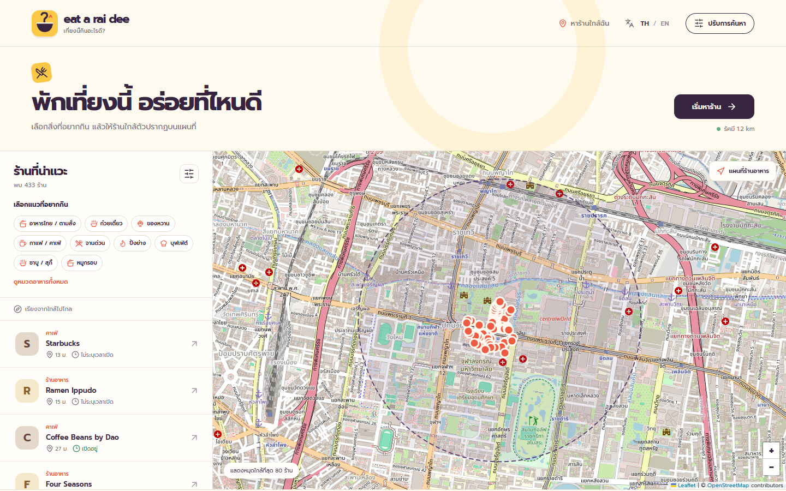
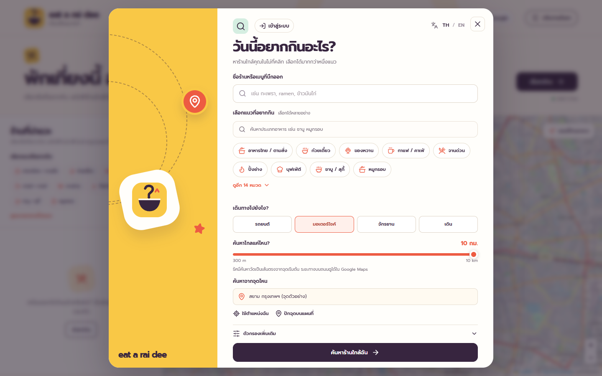

# eat a rai dee

A bilingual lunch finder built with React and TypeScript. Pick a location, search nearby food on an OpenStreetMap map, keep member favorites and reviews with Supabase, and open directions in OpenStreetMap. This repository is also a small example of feature-based frontend architecture.


## Preview



The screenshot uses the sample point in central Bangkok. Restaurant data comes from OpenStreetMap and may change.



## Run locally

Requires Node.js 22.12 or newer and npm.

```bash
npm ci
npm run dev
```

Open the URL printed by Vite, normally `http://127.0.0.1:5173/`. Restaurant search does not require an API key. Supabase-backed member features use the Supabase URL and publishable key in `.env.local`; Google sign-in additionally requires the Google provider to be enabled in Supabase. See [Supabase setup](docs/supabase-setup.md).

| Command                | Purpose                                     |
| ---------------------- | ------------------------------------------- |
| `npm test`             | Run focused behavior and API-boundary tests |
| `npm run lint`         | Check ESLint rules                          |
| `npm run typecheck`    | Check strict TypeScript types               |
| `npm run format:check` | Check Prettier formatting                   |
| `npm run build`        | Build the static site in `dist/`            |
| `npm run preview`      | Preview the production build                |

## Features

- Search by restaurant name or dish; search and combine 23 food categories, including buffet, shabu/suki, and crispy pork.
- Choose your device location, pick a point on the map, or start from the sample point in central Bangkok. Set a 300 m to 10 km radius.
- Filter by opening hours, vegetarian options, wheelchair access, takeaway, and delivery when source tags support them.
- Explore results by straight-line distance, select map pins, and open OpenStreetMap directions for car, bicycle, or walking travel. Motorcycle currently uses the public car-routing profile because the public router does not expose a dedicated motorcycle profile.
- See aggregate ratings from reviews written by members of this site. Places without member reviews remain unrated; the app does not substitute Google ratings.
- Signed-in members can save favorites, add/update/delete their review, and view their free-spin history. Row Level Security keeps member-owned records scoped to their Supabase user.
- Use Free spin as a guest or member. It ranks up to 10 candidates by member rating and then straight-line distance, then chooses uniformly at random from that candidate set; member results are saved to spin history.
- Sign in and out with Google through Supabase Auth once the Google provider is enabled in the Dashboard.
- Switch between Thai and English. The interface uses the Prompt font and adapts to desktop and mobile screens.

## Project layout

```text
.
├── .github/
│   ├── workflows/pages.yml               # Validate PRs; publish main to GitHub Pages
│   └── PULL_REQUEST_TEMPLATE.md           # Review checklist
├── docs/
│   ├── architecture.md                    # Module boundaries and data flow
│   ├── supabase-setup.md                  # Auth and member-data setup
│   └── screenshots/
│       ├── home-desktop.png               # Results and map preview
│       └── search-travel-modes.png        # Travel mode and radius preview
├── public/
│   ├── favicon.svg
│   └── logo.svg
├── src/
│   ├── main.tsx                           # React entry point
│   ├── styles.css                         # Global styles and layout
│   ├── app/
│   │   ├── App.tsx                        # Application composition
│   │   └── i18n.ts                        # Thai and English translations
│   ├── components/ui/
│   │   ├── Brand.tsx                      # Shared branding
│   │   └── LanguageSwitch.tsx             # Language control
│   ├── config/map.ts                      # Map and provider settings
│   ├── features/auth/
│   │   ├── AuthControl.tsx                # Sign-in, account, and sign-out UI
│   │   └── useAuth.ts                     # Supabase session lifecycle
│   ├── features/member/
│   │   ├── components/                    # Member panel and place actions
│   │   ├── data/member-service.ts         # Supabase member-data boundary
│   │   ├── hooks/useMemberData.ts         # Member/rating request lifecycle
│   │   └── model/types.ts                 # Member records and rating types
│   ├── features/spin/model/
│   │   ├── free-spin.ts                   # Candidate ranking and random pick
│   │   └── free-spin.test.ts              # Free-spin behavior tests
│   ├── features/discovery/
│   │   ├── index.ts                       # Public feature entry point
│   │   ├── DiscoveryPage.tsx              # Search, results, member UI, and map composition
│   │   ├── api/
│   │   │   ├── overpass.ts                # Overpass request and OSM normalization
│   │   │   └── overpass.test.ts           # API boundary tests
│   │   ├── hooks/useDiscovery.ts          # Search state and request lifecycle
│   │   ├── model/
│   │   │   ├── types.ts                   # Place and filter types
│   │   │   ├── quick-filter-catalog.ts    # Food category definitions
│   │   │   ├── filter-restaurants.ts      # Distance and filter rules
│   │   │   ├── filter-restaurants.test.ts # Filtering tests
│   │   │   ├── place-details.ts           # Addresses and OSM links
│   │   │   └── place-details.test.ts      # Address and routing tests
│   │   └── components/                    # Search, results, selected place, and map UI
│   └── lib/
│       ├── http.ts                        # Shared HTTP boundary
│       └── supabase.ts                    # Browser client with publishable key
├── supabase/config.toml                  # Local Supabase CLI configuration
├── index.html                            # Static HTML entry point and CSP
├── vite.config.ts                        # Vite build and Pages base path
└── package.json                          # Scripts and dependencies
```

Local development tooling directories (`.serena/`, `.kilo/`, `.codegraph/`) and SQL working files are intentionally ignored and are not part of repository delivery.

See [Architecture](docs/architecture.md) for the data flow and module boundaries. Read [Contributing](CONTRIBUTING.md) before opening a pull request.

## Supabase status

The website includes a Supabase browser client, member-data features, and a Google sign-in button. The production build reads `VITE_SUPABASE_URL` and `VITE_SUPABASE_PUBLISHABLE_KEY` from GitHub Actions variables. Production member storage uses owner-scoped Row Level Security for favorites, reviews, and spin history, while the UI reads an aggregate restaurant-rating summary. **Google sign-in remains unavailable until a valid Google OAuth Client ID and Client Secret are configured and the Google provider is enabled in the Supabase Dashboard.** Follow [Supabase setup](docs/supabase-setup.md) for the exact Auth steps and key handling.

## Data and limitations

Map tiles and place data come from OpenStreetMap and the public Overpass API. Category matches use names and available tags; a restaurant may be missing or lack dish-level information. Filters requiring a specific tag exclude places where it is unknown. Rating values shown by the app come only from reviews submitted through this site; places with no member reviews remain unrated. Search radius and result distances are measured in a straight line, not along roads. OpenStreetMap routing is opened externally; motorcycle currently falls back to the car profile, so users should verify road restrictions before travelling. Wider searches can take longer or fail when the public Overpass service is busy.

The app sends the selected search point and radius to Overpass only when a search starts. It stores language choice and the Supabase Auth session in the browser; it does not store the user's search-location history. Favorites, reviews, and saved free-spin results store restaurant snapshot data such as name, address, and restaurant coordinates in Supabase. Public map and search services have no availability guarantee and are not designed for large-scale traffic. Review the [OSM tile policy](https://operations.osmfoundation.org/policies/tiles/) and [Overpass usage guidance](https://dev.overpass-api.de/overpass-doc/en/preface/commons.html) before wider deployment.

## Delivery

The repository uses `main` and `dev`. Changes to `main` go through a pull request. GitHub Actions checks pull requests into both branches and publishes successful `main` builds to [GitHub Pages](https://engasnm111.github.io/eat-a-rai-dee/). Supabase database administration is separate from the static-site deployment; this repository intentionally does not track SQL working files.

## License and credits

Source code and the original logo are under the [MIT License](LICENSE). Map data © [OpenStreetMap contributors](https://www.openstreetmap.org/copyright). Prompt uses the [SIL Open Font License](https://openfontlicense.org/). See [third-party notices](THIRD_PARTY_NOTICES.md).
